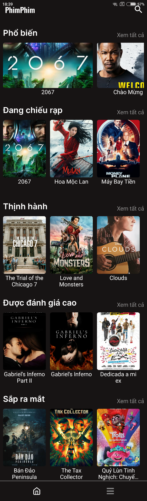
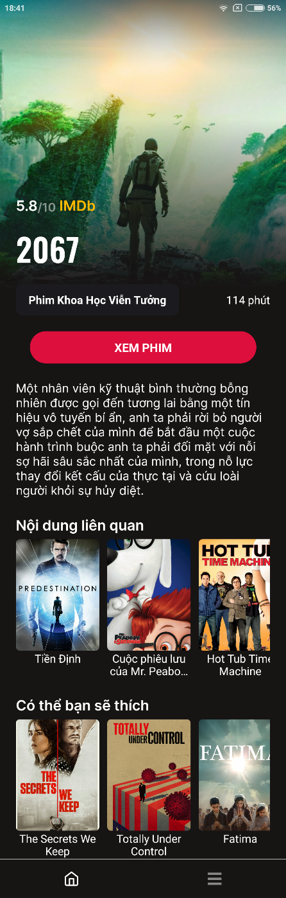

# PhimPhim

## Feature
✅ Data are updated continuously in real-time  
✅ Suggestions according to the movie being watched   
✅ Using for all device: Website | Android | IOS  

## Usage
Download [phimphim.apk](https://drive.google.com/u/0/uc?export=download&confirm=Do-r&id=1XUg0M0YdbHPgB5G9rUu-_Y_Art7MfIao). Enable the “Unknown Sources” setting and install APK.

## Screenshots

  
  

## Library
+ [Themoviedb API](api.themoviedb.org)
+ [expo-google-fonts](https://github.com/expo/google-fonts)
+ [react-navigation](https://reactnavigation.org/)
+ [expo-av](https://docs.expo.io/versions/latest/sdk/av/)
+ [expo-linear-gradient](https://docs.expo.io/versions/latest/sdk/linear-gradient/)
